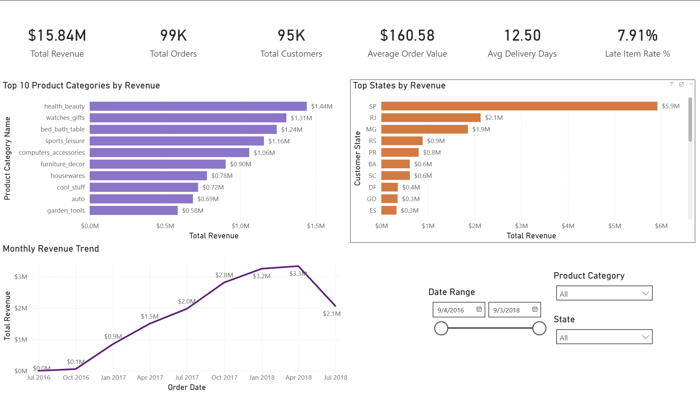
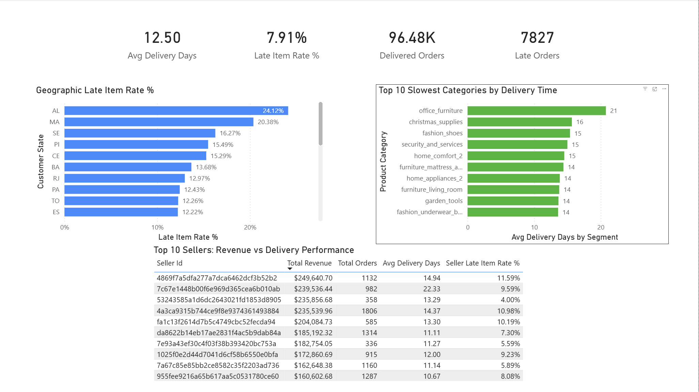
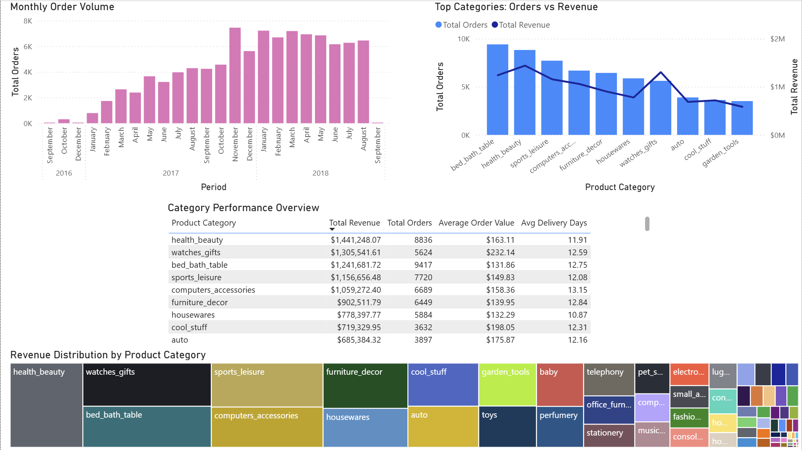

# 📊 E-Commerce Sales & Delivery Performance Dashboard

## 📌 Overview
This project analyzes an e-commerce dataset to uncover insights related to **sales performance, delivery efficiency, and product category trends**.

The solution combines **SQL Server for data transformation** and **Power BI for interactive visualization**, following a real-world analytics workflow.

---

## 🎯 Business Objectives
- Analyze **sales and revenue trends over time**
- Identify **top-performing product categories**
- Evaluate **delivery performance and late orders**
- Compare **seller performance across key metrics**

---

## 🛠️ Tools & Technologies
- **SQL Server** – Data cleaning, transformation, and aggregation  
- **Power BI** – Dashboard development and visualization  
- **Excel** – Initial exploration  

---

## 🗂️ Dataset
The dataset includes multiple tables covering:
- Orders  
- Customers  
- Sellers  
- Products  
- Delivery information  

---

## 🧮 SQL Analysis

The data preparation and analysis were performed using SQL Server, following a structured workflow from raw data exploration to advanced business analysis.

---

### 🔍 Data Exploration
Initial exploration of raw data to understand structure, identify inconsistencies, and assess data quality.

👉 [View Query](sql/01_data_exploration.sql)

---

### 🧹 Data Cleaning & Transformation
Creation of staging tables to standardize and prepare the dataset for analysis:

- Cleaned missing and inconsistent values  
- Standardized formats  
- Prepared product category translation table  

👉 Orders Staging: [View Query](sql/02_staging_orders.sql)  
👉 Category Translation: [View Query](sql/02b_staging_category_translation.sql)  
👉 Sales Staging: [View Query](sql/03_staging_sales.sql)

---

### 📊 Business Analysis
Development of core KPIs used in the dashboard:

- Total Orders  
- Total Revenue  
- Late Orders  
- Average Delivery Days  

👉 [View Query](sql/04_business_analysis.sql)

---

### 🚀 Advanced Analysis
Deeper analysis to support insights and dashboard visuals:

- Category-level performance  
- Seller-level comparisons  
- Delivery performance by region  

👉 [View Query](sql/05_advanced_analysis.sql)

---

## 📊 Dashboard Pages

### 1️⃣ Executive Overview  
[Click to open image](images/1pbi.dashboard_executive_overview.png)

**Summary:**  
Provides a high-level view of business performance, including total revenue, total orders, and late delivery rate. Highlights geographic differences in delivery performance and identifies key product categories contributing to overall revenue.

---

### 2️⃣ Delivery & Operations  
[Click to open image](images/2pbi.dashboard_delivery_operations.png)

**Summary:**  
Focuses on operational efficiency, analyzing late delivery rates across regions and identifying bottlenecks in delivery times. Helps pinpoint underperforming areas in the logistics network.

---

### 3️⃣ Product & Seller Performance  
[Click to open image](images/3pbi.product_seller_performance.png)

**Summary:**  
Explores product category performance and seller behavior, including revenue distribution, order volume trends, and average order value. Identifies top-performing categories and differences between high-volume and high-value segments.

---

## 📈 Key Insights

### 🛍️ Product Performance
- **Health & Beauty** is the top-performing category by revenue, followed by **Watches & Gifts** and **Bed, Bath & Table**  
- Revenue is **highly concentrated**, with a small group of categories driving the majority of sales  
- Categories such as **Office Furniture** have significantly higher delivery times (~21 days), indicating operational inefficiencies  

---

### 📦 Operations & Delivery
- Overall late delivery rate is approximately **7.9%**, indicating room for operational improvement  
- The state of **AL (Alagoas)** shows the highest late delivery rate  
- **RJ (Rio de Janeiro)** combines **high revenue with high late delivery rate (~13%)**, making it a critical operational risk area  

---

### 📊 Sales & Demand Trends
- Revenue and order volume show **consistent growth throughout 2017 and early 2018**  
- The sharp drop at the end of 2018 is likely due to **incomplete data rather than actual business decline**  

---

### 💰 Pricing & Customer Behavior
- Significant variation in **Average Order Value (AOV)** across categories:
  - High AOV categories: **Computers, Watches, Electronics (~$300–$430)**  
  - Low AOV categories: **Home & Lifestyle (~$90–$150)**  
- This indicates a mix of **premium vs volume-driven categories**

---

## 💡 Business Recommendations

### 🚚 Improve Logistics in High-Risk Regions
- Prioritize operational improvements in **AL and RJ**, where late delivery rates are highest  
- Consider optimizing last-mile delivery or logistics partnerships in these regions  

---

### 📈 Focus on High-Performing Categories
- Increase investment in **Health & Beauty, Bed/Bath/Table, and Watches & Gifts**  
- These categories are proven revenue drivers and should be prioritized for growth  

---

### 💎 Expand High AOV Categories
- Categories like **Computers and Electronics** generate high revenue per order  
- Opportunity to increase margins through targeted promotions and product expansion  

---

### ⚠️ Address Category-Level Delivery Issues
- Categories such as **Office Furniture** show long delivery times (~21 days)  
- Improve fulfillment processes for bulky or complex products  

---

### ⚖️ Balance Growth with Operational Performance
- Some high-revenue regions (e.g., **RJ**) show poor delivery performance  
- Improving operations in these areas could significantly enhance customer satisfaction and retention  

---

